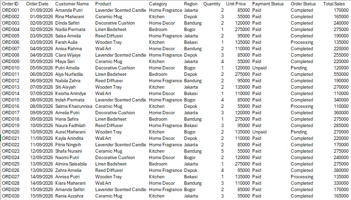
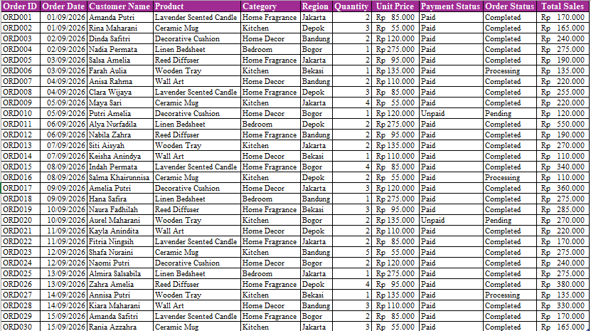
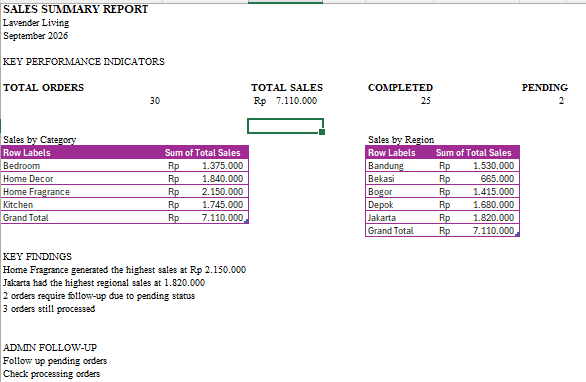

# Sales Data Management & Reporting

A simulated Data Entry and Virtual Assistant project for an online home & lifestyle store.

The project focuses on organizing sales data, performing basic data cleaning, calculating sales totals, creating Pivot Tables, and preparing a simple sales summary report.

## Client Simulation

**Client:** Lavender Living  
**Role:** Data Entry & Virtual Assistant  
**Period:** September 2026

## Tasks Performed

- Entered and organized sales data
- Cleaned and standardized spreadsheet data
- Applied data validation
- Calculated total sales using Excel formulas
- Created Pivot Tables for sales summaries
- Created Pivot Charts
- Prepared a simple sales summary report
- Identified orders requiring administrative follow-up

## Tools

- Microsoft Excel
- Pivot Table
- Data Validation
- Basic Excel Formulas

## Skills Demonstrated

- Data Entry
- Data Cleaning
- Data Organization
- Spreadsheet Management
- Basic Reporting
- Administrative Support
- Excel Data Management

## Project Structure

The Excel workbook contains four sheets:

1. **Raw Data** – Original sales data
2. **Cleaned Data** – Cleaned and standardized data
3. **Pivot Summary** – Pivot Tables and charts
4. **Summary Report** – Key sales metrics and findings

## Key Results

- Total Orders: 30
- Total Sales: Rp7,110,000
- Completed Orders: 25
- Processing Orders: 3
- Pending Orders: 2

## Preview

### Raw Data

### Cleaned Data

### Pivot Summary

### Summary Report

